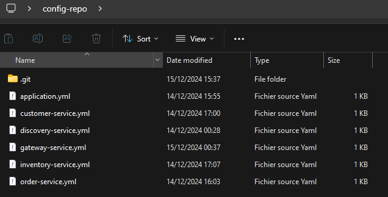
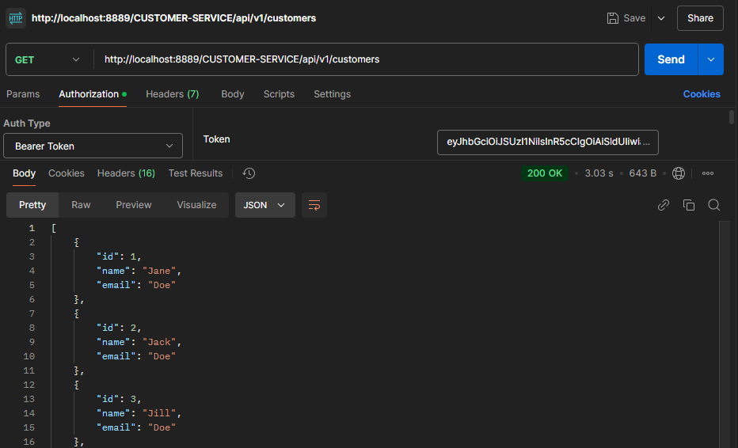
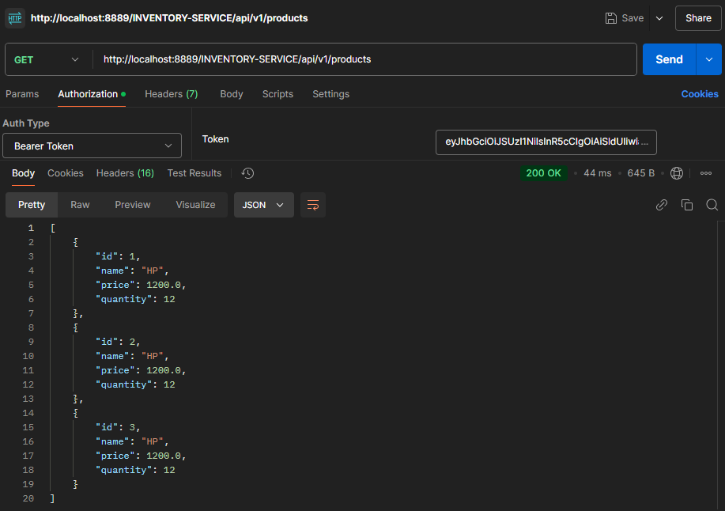

# Distributed Systems : Prartical work"

## 1. Architecture of the Project

## 2. Back-end

### 2.1 Technical Services

- Discovery Service
  
- Config Service
  
- API Gateway
  

### 2.2 Functional Services

- Customer Service
  
- Inventory Service
  
- Order Service
  

### 2.3 Tools Used

#### Backend
- Java
- Spring Eco-System (Spring Boot, Spring Cloud, Spring Data JPA, Spring Security, Spring Web, Spring Actuator, Spring Cloud Sleuth, Spring Cloud Config, Spring Cloud Gateway, Spring Cloud Eureka, Spring Cloud OpenFeign, Spring Cloud Gateway)
- MapStruct
##### Backend Architecture
- 

#### Database
- H2 Database (In-Memory for Development)
- MySQL (Production)

#### Security
- Keycloak
  

#### Frontend
- Angular
 

